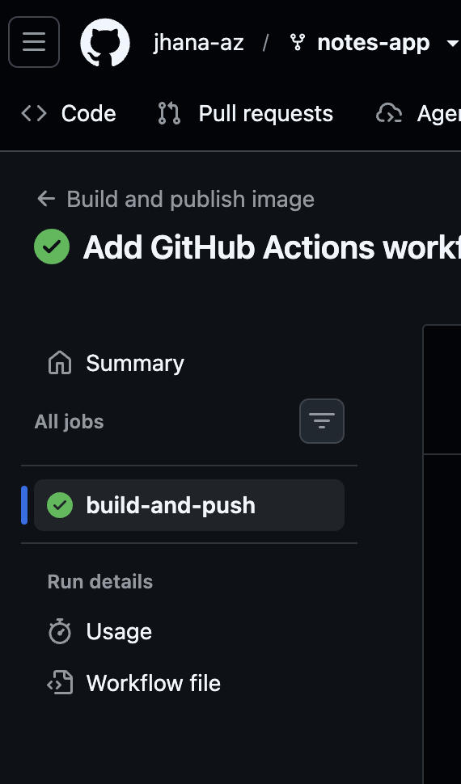
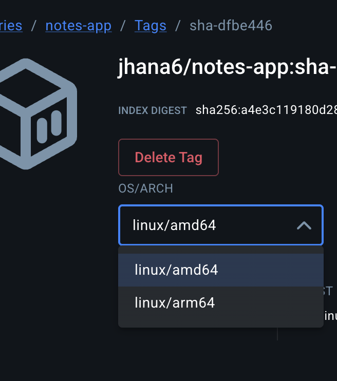

# Lab 5 Evidence

## GitHub Actions run


## Docker Hub tags (amd64 + arm64)


## kubectl get all,pvc
```
Mac:notes-app jameshana$ kubectl get all,pvc
NAME                       READY   STATUS    RESTARTS   AGE
pod/db-6c5c8947cd-zlfbb    1/1     Running   0          19m
pod/web-7d55888c88-2hpcf   1/1     Running   0          3m24s
pod/web-7d55888c88-5gmcn   1/1     Running   0          3m31s

NAME          TYPE        CLUSTER-IP      EXTERNAL-IP   PORT(S)    AGE
service/db    ClusterIP   10.96.173.136   <none>        5432/TCP   40m
service/web   ClusterIP   10.96.68.176    <none>        80/TCP     38m

NAME                  READY   UP-TO-DATE   AVAILABLE   AGE
deployment.apps/db    1/1     1            1           40m
deployment.apps/web   2/2     2            2           38m

NAME                             DESIRED   CURRENT   READY   AGE
replicaset.apps/db-6c5c8947cd    1         1         1       40m
replicaset.apps/web-794c8495bc   0         0         0       6m41s
replicaset.apps/web-7d55888c88   2         2         2       38m

NAME                            STATUS   VOLUME                                     CAPACITY   ACCESS MODES   STORAGECLASS   VOLUMEATTRIBUTESCLASS   AGE
persistentvolumeclaim/db-data   Bound    pvc-8375ece9-9989-4920-b06f-c4f704bd58e6   1Gi        RWO            standard       <unset>                 40m
```

## Part 3 Experiment 2: Notes survive deleting the database pod
```
[{"body":"hello from kubernetes","created_at":"2026-09-27T23:31:59.325946+00:00","id":1},{"body":"I should survive a pod deletion","created_at":"2026-09-27T23:39:14.988235+00:00","id":2}]
```
Both notes survived because the data lives in the PersistentVolumeClaim (`db-data`), not in the pod. The replacement db pod reattached to the same volume.

## Part 3 Experiment 3: Load balancing (multiple served_by values)
```
{"message":"from the PR branch","served_by":"web-7d55888c88-cfb7d","service":"notes-app"}
{"message":"from the PR branch","served_by":"web-7d55888c88-2td2p","service":"notes-app"}
{"message":"from the PR branch","served_by":"web-7d55888c88-99nfw","service":"notes-app"}
```
Three different pods answered requests to the `web` Service, showing traffic spread across replicas.

## kubectl rollout history deployment/web
```
deployment.apps/web
REVISION  CHANGE-CAUSE
1         <none>
2         <none>
```
Revision 1 used `jhana6/notes-app:latest`; revision 2 used `jhana6/notes-app:sha-2b29aed`. After `kubectl rollout undo`, the app still showed "version 2" because the `latest` tag had moved to the new build. This shows why immutable `sha-` tags are safer for deployments than `latest`.